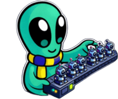

##Bot Farm

This repository is dedicated to store AI Conversational Agents for Supporting Teaching & Learning and the well-being of UCSC Students (conversational and non-conversational), developed by the @botForce team and internal collaborators. They are developed in a web chat format using Botpress, Make, TypeScript, and JavaScript.

- ​[SoftWise - 2026 Jan 06.bpz] para web v1.0.1 (creado por Claudia Martínez-Araneda y Alejandra Segura-Navarrete)
- [CEABot - 2026 Jan 06.bpz] para web v1.0.1 (creado por Claudia Martínez-Araneda y Pilar Ubilla Bustamante)
- [tutorBot - 2026 Jan 06.bpz] para web v1.0.2 (creado por Claudia Martínez-Araneda, Mariella Gutiérrez V., Pedro Gómez M. y Diego Maldonado M.)
- [tutorB@t - 2026 Jan 06.bpz]​ para web (con workflow, versión más antigua) - deprecated v1.0.0
- [UCSCBot.-.2026.Jan.07.zip] para Discord v1.0.1 (creado por Nicolás Cereceda)

@botForce team members
- Claudia Martínez-Araneda [cmartinez.ucsc@gmail.com] [cmartinez@ucsc.cl]
- Nicolás Cereceda Squella [ncereceda@ucsc.cl]

Internal collaborators
- Mariella Gutiérrez Valenzuela [mariellag@ucsc.cl]
- Nicolás Cereceda Squella [ncereceda@ucsc.cl]
- Pedro Gómez Meneses [pgomeza@ucsc.cl]
  
External collaborators 
- Diego Maldonado Montiel [dmaldonado@gmail.com]
- Alejandra Segura-Navarrete [asegura@ubiobio.cl]
- Pilar Ubilla Bustamante [pubilla@ucsc.cl]
