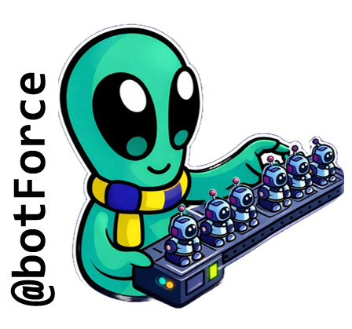

**Bot Farm**

This repository is dedicated to storing AI Conversational Agents for Supporting Teaching & Learning and the well-being of UCSC Students (conversational and non-conversational), developed by the @botForce team. They are developed in a web chat format using Botpress, Make, TypeScript, and JavaScript.

- [SoftWise - 2026 Jan 06.bpz] para web
- [tutorBot - 2026 Jan 06.bpz]​ para web
- [tutorB@t - 2026 Jan 06.bpz]​ para web
- [CEABot - 2026 Jan 06.bpz] para web
- [UCSCBot.-.2026.Jan.07.zip] para Discord

@botForce team members
- Claudia Martínez-Araneda [cmartinez.ucsc@gmail.com]
- Nicolás Cereceda Squella [ncereceda@ucsc.cl]
